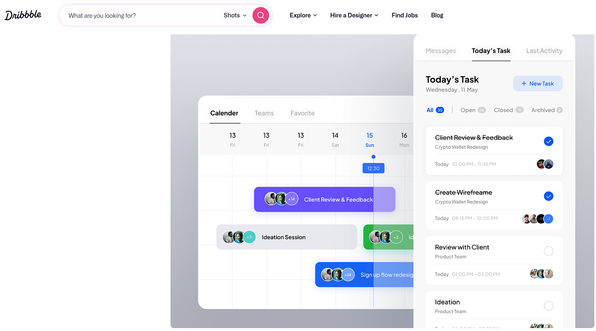

# Task Management App - InfoCasas Challenge

A personal task management application built with React Native that helps users track and organize their daily tasks efficiently. This app features a clean, modern interface inspired by professional task management tools, with capabilities for creating, updating, and managing tasks locally on your device.




## 🚀 Features

- Create, update, and delete tasks
- Filter tasks by completion status
- Search tasks by name
- Persistent local storage
- Clean and intuitive user interface
- Task categorization and organization
- Real-time updates

## 📋 Prerequisites

Before you begin, ensure you have met the following requirements:

- Node.js (v18.x or higher) - v18.20.4 LTS
- Java Development Kit (JDK) 17 - java 17.0.9 2023-10-17 LTS
- Android Studio (for Android development)
- Xcode (for iOS development, macOS only)
- React Native CLI

## ⚙️ Installation and Setup

1. **First, install React Native CLI globally:**

```bash
npm install -g react-native-cli
```

2. **Clone the repository:**

```bash
git clone https://github.com/yourusername/infocasas-task-app.git
cd infocasas-task-app
```

3. **Install dependencies:**

```bash
npm install / yarn install
```

4. **Install iOS dependencies (macOS only):**

```bash
cd ios
pod install
cd ..
```

## 📱 Running the App

Make sure you have an Android emulator/device or iOS simulator/device ready.

5. **Start Metro Bundler (if not already running):**

```bash
npm start --reset-cache
```

6. **Run on your preferred platform:**

```bash
# iOS
npm run ios / npx react-native run-ios

# Android
npm run android / npx react-native run-android
```

## 🛠️ Technology Choices and Libraries

Here's an explanation of the key libraries used in this project:

- **@react-native-async-storage/async-storage (^2.0.0)**

  - Chosen for reliable local data persistence
  - Industry standard for React Native storage solutions
  - Provides simple async data storage system

- **moment (^2.30.1)**

  - Used for sophisticated date handling and formatting
  - Makes working with dates and times more intuitive
  - Provides excellent localization support

- **react (18.3.1) & react-native (0.76.0)**

  - Latest stable versions ensuring optimal performance
  - Access to the newest features and improvements
  - Strong community support and documentation

- **react-native-autocomplete-dropdown (^4.0.0)**

  - Enhances task search functionality
  - Provides smooth and responsive search experience
  - Easy to integrate and customize

- **react-native-svg (^15.8.0)**

  - Required for rendering custom icons and graphics
  - Enables creation of scalable vector graphics
  - Optimizes app performance with vector images

- **react-native-vector-icons (^10.2.0)**

  - Comprehensive icon library
  - Consistent cross-platform icon rendering
  - Wide variety of icon options

- **zustand (^5.0.0)**
  - Lightweight state management solution
  - Simple and intuitive API
  - Excellent performance characteristics
  - Reduced boilerplate compared to Redux

## 🏗️ Project Structure

```
src/
├── components/
├── screens/
├── store/
├── types/
├── utils/
└── assets/
```

## 🤝 Contributing

This project is part of an InfoCasas challenge submission. While it's not open for direct contributions, feedback and suggestions are welcome.

## 📝 License

This project is licensed under the MIT License - see the LICENSE file for details.

## 👤 Author

Your Name

- GitHub: [@druidsnake](https://github.com/Druidsnake)
- LinkedIn: [ricardo-aguinaga](https://www.linkedin.com/in/ricardo-aguinaga/)

---

⭐️ Created as part of the InfoCasas Challenge - 2024
